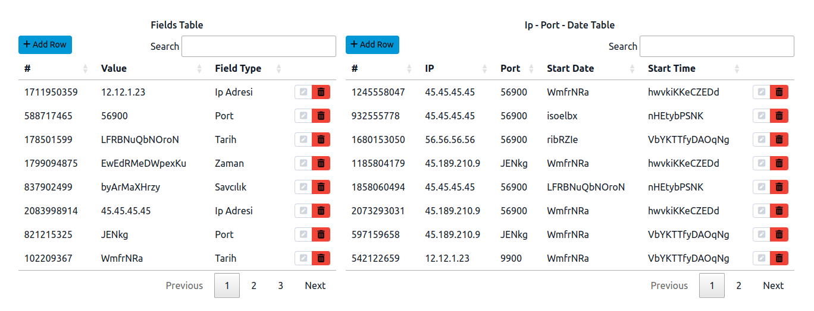

# datatables2tabledit

### Dt2Te: Datatables & Tabledit integration
- Datatables: https://datatables.net/
- JQuery-Tabledit: https://markcell.github.io/jquery-tabledit
- **Integration jquery plugin:** src/main/resources/public/content/js/dataTables.2.tableedit.js
- **Integration plugin usage:** src/main/resources/public/content/js/script.js
- **Backend:** Spring Boot, Spring Rest, Thymeleaf
- **Installation:**
  - Clone project
  - run `mvn install` in project directory
  - Open http://localhost:8080 in your browser
  - Click around & find out

